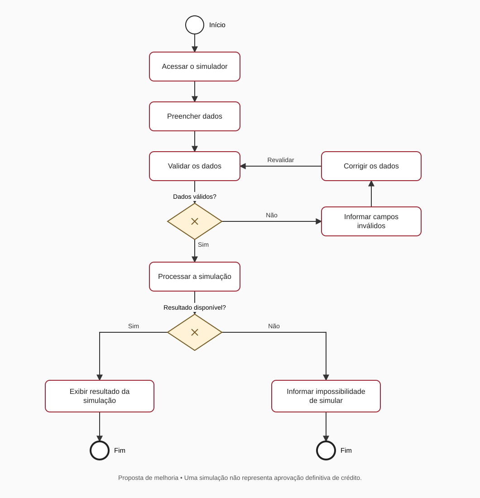

# Teste técnico de QA — Simulação de crédito

Estudo de testes funcionais manuais em uma jornada web de simulação de financiamento imobiliário. Reúne planejamento de testes, relatos de problemas com evidências e modelagem de processo.

## Entregas

- [7 casos de teste](test-cases/test-cases.md), com condições e dependências explícitas.
- [Registro de execução](test-cases/registro-de-execucao.md), preparado para preencher em uma nova rodada.
- [2 relatos históricos de bugs](bugs/bug-reports.md), com passos, resultados esperados e observados, severidade e evidências.
- [Fluxo As Is original](bpmn/simulacao_credito_as_is.png).
- Fluxo To Be revisado: [visualizar diagrama](bpmn/simulacao_credito_to_be.svg) · [baixar fonte BPMN 2.0](bpmn/simulacao_credito_to_be.bpmn).

## Escopo

- Produto avaliado no teste técnico: simulador de financiamento imobiliário do Banco do Brasil.
- Canal: web, com usuário não autenticado.
- Técnicas: testes funcionais manuais, cenários negativos e análise de valores-limite.
- Ferramentas: Google Chrome, Markdown e Bizagi Modeler nos diagramas originais; fonte BPMN 2.0 e prévia SVG na revisão do fluxo proposto.
- Página inicial: https://www.bb.com.br/site/pra-voce/financiamentos/financiamento-imobiliario/

Este é um estudo independente para teste técnico; não representa vínculo profissional com o banco.

## Fora de escopo

Autenticação, integrações internas, persistência no banco de dados, regras de cálculo não observáveis e concessão real de crédito. Um resultado de simulação não equivale a aprovação definitiva.

## Situação das evidências

Os dois relatos e as imagens existentes pertencem à execução original. O material original não registra data, ambiente completo nem status individual dos sete casos. A revisão da documentação não reexecutou o simulador e não atribui resultados aos casos sem evidência.

O registro de execução começa com **Não registrado**. Preencha-o com os resultados reais de uma nova rodada; se faltarem massa, regra ou limite necessário, documente o bloqueio.

## Como realizar a próxima rodada

1. Registrar data, navegador, sistema operacional e URL final.
2. Confirmar os campos e as regras atuais do simulador.
3. Definir massas fictícias distintas para CT-01 e CT-02, com a fonte das condições que justificam cada retorno.
4. Executar os casos aplicáveis, separando variações de campos e limites.
5. Preencher resultado obtido, status e evidência; revalidar os bugs quando possível.
6. Registrar as conclusões com base no observado, incluindo bloqueios e limitações.

## Processo proposto

No fluxo revisado, dados inválidos geram orientação ao usuário. Depois da correção, os dados retornam à validação antes do processamento. Os ramos de saída representam resultado disponível ou impossibilidade de simular, sem afirmar aprovação ou recusa definitiva de crédito.

O arquivo `bpmn/simulacao_credito_to_be.png` foi preservado como versão original do teste técnico. A proposta atual está no SVG e no arquivo BPMN vinculados acima; ela não descreve implementação confirmada do sistema avaliado.
