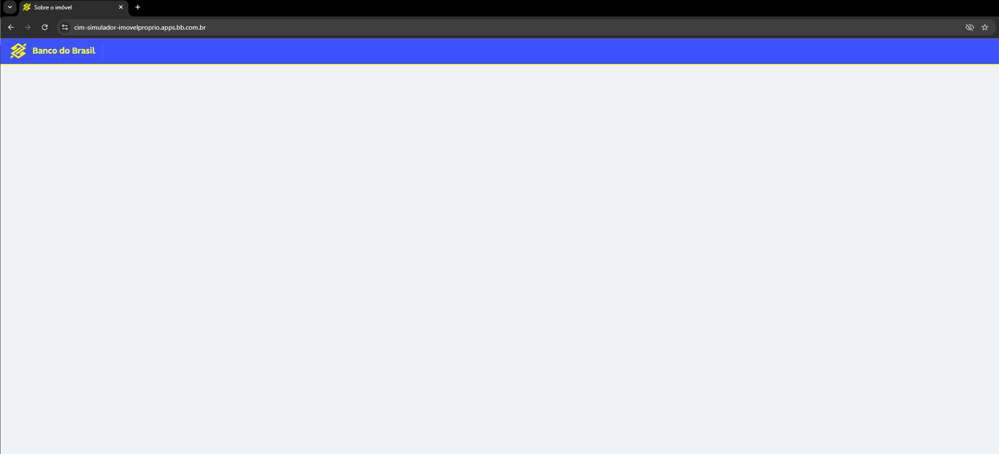
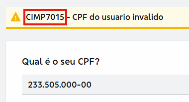

# Registro de bugs

Relatos históricos preservados do teste técnico. Data de execução, versão do navegador e sistema operacional não constam no registro original. O comportamento atual e a correção dos problemas não foram revalidados nesta revisão.

## Bug 01 – Página em branco ao clicar no logo do Banco do Brasil 

**Passos para reproduzir:**
1. Acessar a página de financiamento imobiliário do Banco do Brasil
2. Clicar em SIMULE AGORA
3. Clicar no logo do Banco do Brasil

**Resultado Esperado:**
O clique deve levar ao destino previsto pelo produto, sem deixar a página em branco. O registro original esperava a página inicial; esse destino precisa ser confirmado como critério de aceitação.

**Resultado Atual:**
Página retorna em branco.

**Severidade:**
Média

**Evidência:**

## Bug 02 – CPF com código de erro

**Passos para reproduzir:**
1. Acessar a página de financiamento imobiliário do Banco do Brasil
2. Clicar em SIMULE AGORA
3. Preencher o campo de CPF sendo ele um CPF inválido

**Resultado Esperado:**
Sistema deve retornar mensagem de CPF inválido.

**Resultado Atual:**
No registro original, o sistema exibe uma mensagem de CPF inválido acompanhada de um código técnico. A classificação como problema de usabilidade precisa considerar se esse código tem finalidade de suporte prevista pelo produto.

**Severidade:**
Baixa

**Evidência:**

## Observação
Os relatos indicam possíveis impactos na experiência do usuário. As evidências disponíveis não permitem concluir o impacto sobre todo o fluxo. As severidades são as classificações originais e devem ser reavaliadas após reprodução.

Para cada nova reprodução, registrar: data e horário, URL, navegador e versão, sistema operacional, massa fictícia identificada, frequência de ocorrência e nova evidência.